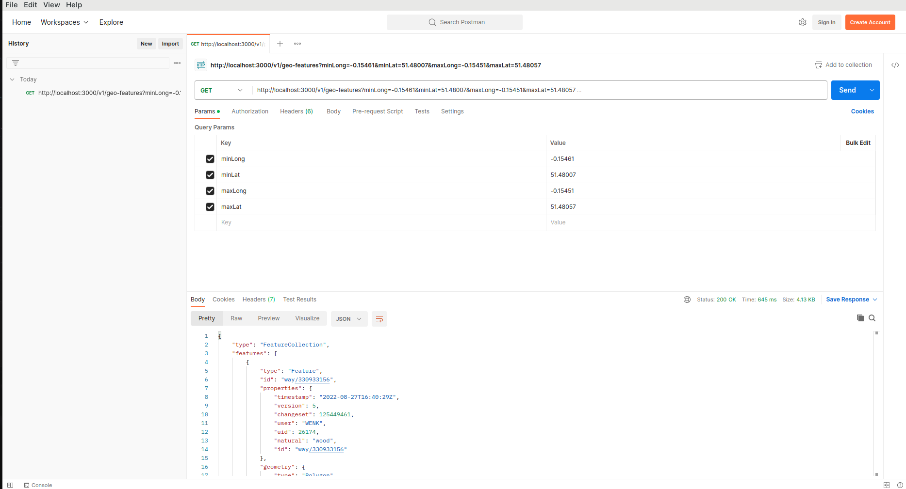

# GEO-PRO

Geo-pro is a service to get features inside a bounding box marked by latitude and longitude co-ordinates

## Getting Started

* Pull the project with git command
    SSH
    ```
    git@github.com:YogirajT/geo-pro.git
    ```
    OR HTTP
    ```
    https://github.com/YogirajT/geo-pro.git
    ```

* Get docker-compose for your machine

    ex. For Ubuntu refer
    ```
    https://www.digitalocean.com/community/tutorials/how-to-install-docker-compose-on-ubuntu-18-04
    ```

* Set up .env file in the monorepo root by referring to .sample.env 

* Run command 
    ```
    sudo docker compose up
    ```

* After the installation completes the server should be available on (if the port in .sample.env wasn't changed)
    ```
    http://localhost:3000
    ````

## Usage

* Query parameters

  -minLong (number)
  -minLat (number)
  -maxLong (number)
  -maxLat (number)

* [Postman Collection](__docs__/geo-pro.postman_collection.json)

* Launch postman and hit the following get endpoint
    ```
    http://localhost:3000/v1/geo-features?minLong=-0.15461&minLat=51.48007&maxLong=-0.15451&maxLat=51.48057
    ```

## Folder structure

|  |  |  |  |  |
| ------ | ------ | ------ | ------ | ------ |
| \_\_docs\_\_ | documentation folder  |  |  |
| src  |   |
|   | \common  | shared classes |
|   |  | \dto | data transfer object |
|   |  | \exceptions | custom exceptions |
|   |  | \factories | utility functions for generating/tranforming objects |
|   |  | \filters | exception filters |
|   |  | \pipes | pipes for custom validation |
|   | \models | BBox model |
|   | \open-street-map | service for calling the open-street-map api |
|   | \app.*.ts | app controllers, service, and module |
|   | \test | e2e tests |


## Screenshot
<picture>
  
</picture>